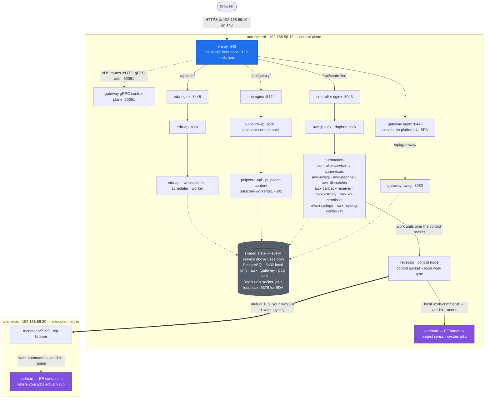

# ACE the Hard Way

This tutorial walks you through building an open source automation platform the hard way — **from source, bare metal** — so you understand every process, every config file, and every wire. "Bare metal" means literally that: every service is a real process on the box, and containers appear in exactly one role — as execution-environment sandboxes for jobs.

The goal is precise: **hand-build a complete automation platform from upstream source** — a dedicated service user, a deliberate directory layout (AWX's historical `/etc/tower` paths included, on purpose), a supervisor process family you write yourself, and nginx wiring you can read end to end. Every piece is a real process you can inspect, restart, and break.

It builds that architecture from upstream community projects:

- **Control node** — built by hand on a Linux VM: PostgreSQL, Redis, [AWX](https://github.com/ansible/awx) built from source into a virtualenv, its UI built from source, every process (uwsgi, daphne, dispatcher, callback receiver, wsrelay) running under **supervisord configs you wrote** — the same process topology a real production deployment runs — plus receptor from the release binary, behind nginx. Then the platform gateway on top.
- **Execution plane** — a second VM (its first node) joined over a **receptor mesh you build yourself**: release binary, hand-made TLS certs, work signing. Jobs dispatch across the mesh and run there in execution environments. Later, the same plane concept extends to Kubernetes via container groups — the control plane never knows the difference.

No installer. No operator. No docker-compose. No Kubernetes.

> Inspired by [kubernetes-the-hard-way](https://github.com/kelseyhightower/kubernetes-the-hard-way): there the binaries are the artifacts and you write the units by hand. AWX doesn't ship runnable binaries — so here you build the artifacts from source too, then still write every unit by hand. Where upstream *does* ship a real binary (receptor, envoy, k3s), we use the tarball, KTHW style.
>
> The results are not production-ready. The *understanding* is the product.

## What you end up with

Two VMs, nineteen labs later. Every box below is a process you started by hand, from a config file you wrote:

A few things the picture is meant to make obvious. **One front door:** envoy on 443 is the only port a browser touches; the four services behind it sit on internal ports (8043/8444/8445/8446) and every request carries the gateway's JWT. **The ports are a single-box tax:** the real design gives the controller, hub, and EDA each their own host on 443 — here they share one VM, so they move aside ([Lab 19](docs/19-platform-ui.md) does that pivot). **nginx-to-app hops are unix sockets, not TCP** — nothing for a remote client to reach. **Containers appear twice, both times as EE sandboxes** (purple) — never as a service. **Receptor is the parent of podman on both nodes:** the dispatcher never launches a container itself, it submits a signed work unit to receptor, and receptor's work-command spawns `ansible-runner`, which starts the EE. Control-plane work (project syncs, system jobs) takes that path locally through `ace-control`'s own receptor; job work takes the identical path across the mesh on `ace-exec`. And the two VMs are joined by exactly one thing: that mesh, with a CA, certs, and work-signing keys you generated yourself.

## Who this is for

You run (or will run) AWX or a similar automation platform, and you want to know what's actually inside — not just what an install script prints at you. Bare-metal AWX hasn't been officially supported since v18; this is the map nobody publishes anymore.

## What you need

- A laptop with ~16 GB RAM free for VMs
- [Vagrant](https://developer.hashicorp.com/vagrant) with a supported provider — run end-to-end on **KVM/libvirt (Linux, x86_64)** and **VMware Fusion (macOS, Apple Silicon or Intel)**; the default box publishes both architectures. Pick your track in [Lab 1](docs/01-prerequisites.md).
- Patience — that's the "hard way" part

## Labs

**Foundations**

1. [Prerequisites](docs/01-prerequisites.md)
2. [Provisioning the VMs](docs/02-vms.md)
3. [PostgreSQL](docs/03-postgresql.md)
4. [Redis](docs/04-redis.md)

**AWX from source**

5. [AWX from source](docs/05-awx-source.md)
6. [Configuring AWX](docs/06-awx-config.md)
7. [Database init](docs/07-awx-init.md)
8. [Running the services](docs/08-awx-services.md)
9. [Building the UI](docs/09-awx-ui.md)
10. [nginx front door](docs/10-nginx.md)
11. [Receptor](docs/11-receptor.md)

**Jobs on the mesh**

12. [The execution plane](docs/12-execution-plane.md)
13. [Instance registration](docs/13-instance-registration.md)
14. [Smoke test: run a job on the execution plane](docs/14-smoke-test.md)

**The platform layer**

15. [The gateway](docs/15-gateway.md)
16. [Service registration](docs/16-service-registration.md)

**The other platform services**

17. [Automation Hub](docs/17-hub.md) — galaxy_ng on pulpcore from source, behind the gateway
18. [Event-Driven Ansible](docs/18-eda.md) — eda-server from source, behind the gateway
19. [The platform UI](docs/19-platform-ui.md) — the unified Ansible console (`@ansible/platform-ui`), served by the gateway on 443

**Appendix labs — break it on purpose**

- [A1: The EPEL uwsgi conflict](docs/a1-epel-uwsgi-conflict.md) — deliberately clobber your uwsgi, diagnose the ABI mismatch, armor the box with `excludepkgs`
- [A2: The same stack, native systemd](docs/a2-native-systemd.md) — rebuild Lab 8 without supervisord and compare both worlds
- [A3: Backup and restore](docs/a3-backup-restore.md) — what actually holds state, and proving you can get it back

— [Glossary](docs/glossary.md) · [Cleanup](docs/99-cleanup.md)

## A note on containers

Everything you build and operate is bare metal. Podman appears only as the **execution-environment sandbox**, on every node that runs work — jobs on the execution plane, project syncs and system jobs on the controller — because an EE *is* a container image and AWX has had no containerless execution since v18. That is the only place podman appears: no service you build runs in a container.

ACE is an independent assembly of upstream community projects — [AWX](https://github.com/ansible/awx), [receptor](https://github.com/ansible/receptor), [jewel](https://github.com/ansible/jewel), [galaxy_ng](https://github.com/ansible/galaxy_ng), and [eda-server](https://github.com/ansible/eda-server) — wired together by hand.

## License

Content is licensed CC BY 4.0 unless noted otherwise.
