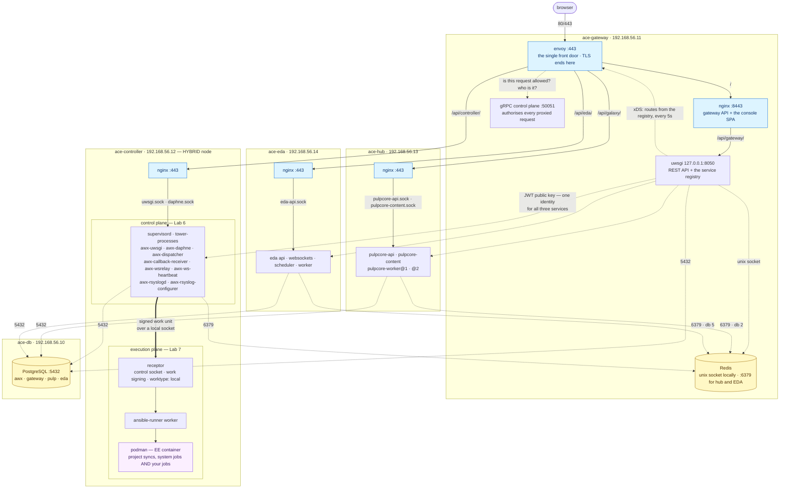

# ACE the Hard Way

This tutorial walks you through building an open source automation platform the hard way — **from source, bare metal** — so you understand every process, every config file, and every wire. "Bare metal" means literally that: every service is a real process on the box, and containers appear in exactly one role — as execution-environment sandboxes for jobs.

The goal is precise: **hand-build a complete automation platform from upstream source, spread across five machines** — a dedicated service user per component, a deliberate directory layout (AWX's historical `/etc/tower` paths included, on purpose), a supervisor process family you write yourself, one private CA signing every service, and nginx wiring you can read end to end. Every piece is a real process you can inspect, restart, and break.

Five machines rather than one is the point, not an inconvenience. On a single box "the controller talks to the database" is a unix socket and a shrug; across five it is a hostname, a port, a firewall rule, and a certificate whose SAN has to match — and when it breaks, you find out which.

It builds that architecture from upstream community projects:

- **ace-db** — PostgreSQL on a host of its own, serving four databases to four machines. No HTTP, no certificate, nothing to register.
- **ace-gateway** — the [platform gateway](https://github.com/ansible/jewel) built from source, with Redis colocated, the unified console ([ansible-ui](https://github.com/ansible/ansible-ui)) built from source, and **envoy** on 443 in front. It is not a reverse proxy you point at things: every route envoy serves is a row in the gateway's registry, and every other component *registers itself* here.
- **ace-controller** — [AWX](https://github.com/ansible/awx) built from source into a virtualenv, with every process (uwsgi, daphne, dispatcher, callback receiver, wsrelay, ws-heartbeat, and the rsyslog pair) running under **supervisord drop-ins you wrote** — the same process topology a real deployment runs — behind its own nginx.
- **The execution plane** — [receptor](https://github.com/ansible/receptor) from the release binary, with **work signing you set up yourself**, plus podman. The controller hands receptor a *signed work unit* over a local socket; receptor spawns `ansible-runner`; ansible-runner starts the job in an execution environment. Built as its own lab because on a production build of this topology it is its own VM — here the controller doubles as a **hybrid** node to save a machine.
- **ace-hub** — [galaxy_ng](https://github.com/ansible/galaxy_ng) on pulpcore, the private content repository the controller pulls collections and EE images from.
- **ace-eda** — [eda-server](https://github.com/ansible/eda-server), which closes the loop: an event fires a rulebook, the rulebook launches a job template on the controller.

No installer. No operator. No docker-compose. No Kubernetes.

> Inspired by [kubernetes-the-hard-way](https://github.com/kelseyhightower/kubernetes-the-hard-way): there the binaries are the artifacts and you write the units by hand. AWX doesn't ship runnable binaries — so here you build the artifacts from source too, then still write every unit by hand. Where upstream *does* ship a real binary (receptor, envoy, k3s), we use the tarball, KTHW style.
>
> The results are not production-ready. The *understanding* is the product.

## What you end up with

Two VMs, nineteen labs later. Every box below is a process you started by hand, from a config file you wrote:

A few things the picture is meant to make obvious. **One front door:** envoy on 443 is the only port a browser touches. **But envoy is only the data plane — the gateway is what assembles the platform.** Every route it serves is a row in the gateway's service registry, fetched over xDS every five seconds; every request is checked against the gateway's gRPC control plane; and the identity that comes back is a JWT signed by the gateway, which the controller, hub and EDA each validate against a public key they fetch from it at runtime. That is what "one login for the whole platform" means mechanically — three independently built services trusting one issuer. **Every component serves 443 on its own host**, because it has a host to itself; only the gateway uses 8443, and only because envoy shares its machine. **nginx-to-app hops are unix sockets, not TCP** — nothing for a remote client to reach. **The controller box is split in two on purpose:** the control plane decides a job should run, the execution plane runs it, and the only thing joining them is a *signed work unit over a local socket*. That is why they are two labs — and why on a production build of this topology the execution half is a sixth VM instead, with nothing else changing. **Receptor is the parent of podman**, never the reverse: the dispatcher hands receptor a work unit, receptor's work-command spawns `ansible-runner`, and ansible-runner starts the container (purple — the only container in the build). And the one thing every VM shares is the CA in [Lab 3](docs/03-internal-ca.md): five trust stores, one root, and no private key that ever crossed a machine boundary.

## Who this is for

You run (or will run) AWX or a similar automation platform, and you want to know what's actually inside — not just what an install script prints at you. Bare-metal AWX hasn't been officially supported since v18; this is the map nobody publishes anymore.

## What you need

- A laptop with ~16 GB RAM free for VMs
- [Vagrant](https://developer.hashicorp.com/vagrant) with a supported provider — run end-to-end on **KVM/libvirt (Linux, x86_64)** and **VMware Fusion (macOS, Apple Silicon or Intel)**; the default box publishes both architectures. Pick your track in [Lab 1](docs/01-prerequisites.md).
- Patience — that's the "hard way" part

## Labs

**Foundations**

1. [Prerequisites](docs/01-prerequisites.md)
2. [The five VMs](docs/02-vms.md) — the estate, and why each component gets its own machine
3. [The internal CA](docs/03-internal-ca.md) — one root, trusted everywhere, signing every service

**The components, one lab each**

4. [PostgreSQL](docs/04-postgresql.md) — `ace-db`; four roles, four databases, one server
5. [The platform gateway](docs/05-gateway.md) — `ace-gateway`; jewel, Redis, nginx, the console, envoy — then it registers itself and 443 opens
6. [The automation controller](docs/06-controller.md) — `ace-controller`; AWX, its eight processes, nginx — registered and browsable, and unable to run a thing
7. [Execution: receptor and podman](docs/07-execution.md) — the other end of that; the controller becomes a hybrid node and the first job runs
8. [Automation hub](docs/08-hub.md) — `ace-hub`; galaxy_ng on pulpcore
9. [Event-Driven Ansible](docs/09-eda.md) — `ace-eda`; eda-server, and the loop closes

**Appendix labs — break it on purpose**

- [A1: The EPEL uwsgi conflict](docs/a1-epel-uwsgi-conflict.md) — deliberately clobber your uwsgi, diagnose the ABI mismatch, armor the box with `excludepkgs`
- [A2: Backup and restore](docs/a2-backup-restore.md) — what actually holds state, and proving you can get it back

— [Glossary](docs/glossary.md) · [Cleanup](docs/99-cleanup.md)

## A note on containers

Everything you build and operate is bare metal. Podman appears only as the **execution-environment sandbox**, on every node that runs work — jobs on the execution plane, project syncs and system jobs on the controller — because an EE *is* a container image and AWX has had no containerless execution since v18. That is the only place podman appears: no service you build runs in a container.

ACE is an independent assembly of upstream community projects — [AWX](https://github.com/ansible/awx), [ansible-ui](https://github.com/ansible/ansible-ui), [receptor](https://github.com/ansible/receptor), [jewel](https://github.com/ansible/jewel), [galaxy_ng](https://github.com/ansible/galaxy_ng), and [eda-server](https://github.com/ansible/eda-server) — plus [envoy](https://github.com/envoyproxy/envoy) as the gateway's proxy, wired together by hand.

## License

Content is licensed CC BY 4.0 unless noted otherwise.
