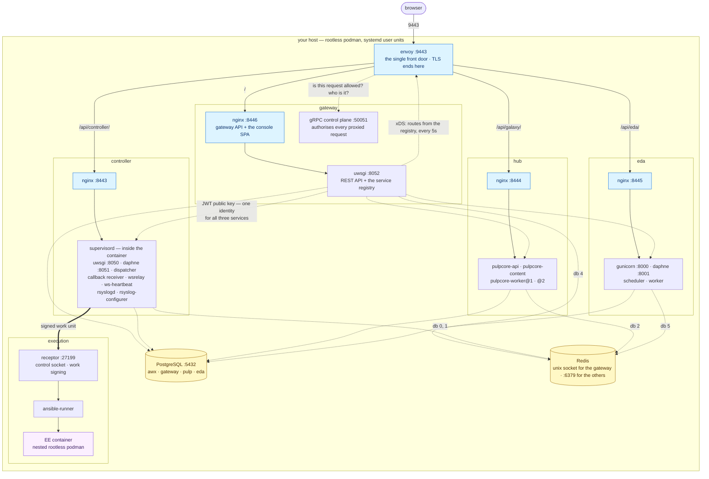

# ACE the Hard Way — the containerized track

This tutorial walks you through building an open source automation platform the hard way — **from source, into container images you write yourself** — so you understand every build step, every config file, and every wire. "From source" means literally that: no image is pulled and trusted; the ones that carry the platform are cloned at a pinned commit and built in front of you.

The goal is precise: **hand-build a complete automation platform from upstream source, package it into images you author, and run it as rootless podman containers on a single machine you already own** — a Containerfile per component, one private CA signing every service, a quadlet per container that you write, and an nginx-and-uwsgi wiring you can read end to end. Every piece is something you can inspect, rebuild, and break.

> **This is the containerized track.** The [bare-metal track](../../tree/main) builds the same platform as ordinary processes across five VMs. Neither is a stage of the other — they are two answers to the same question, and the lab numbering matches so you can read them side by side.

It builds that architecture from upstream community projects:

- **The gateway** — the [platform gateway](https://github.com/ansible/jewel) built from source with the unified console ([ansible-ui](https://github.com/ansible/ansible-ui)) compiled into the same image, Redis alongside it, and **envoy** in front. It is not a reverse proxy you point at things: every route envoy serves is a row in the gateway's registry, and every other component *registers itself* here.
- **The controller** — [AWX](https://github.com/ansible/awx) built from source into a virtualenv inside its image, with every process (uwsgi, daphne, dispatcher, callback receiver, wsrelay, ws-heartbeat, and the rsyslog pair) running under **supervisord configs you wrote**. The container does not replace supervisor; it contains it — the same thing the vendor's own containerized build does.
- **The execution plane** — [receptor](https://github.com/ansible/receptor) built from source, with **work signing you set up yourself**, and an execution environment built with `ansible-builder`. The controller hands receptor a *signed work unit*; receptor spawns `ansible-runner`; ansible-runner starts your job in a container, from inside a container.
- **The hub** — [galaxy_ng](https://github.com/ansible/galaxy_ng) on pulpcore, the private content repository the controller pulls collections and EE images from.
- **EDA** — [eda-server](https://github.com/ansible/eda-server), which closes the loop: an event fires a rulebook, the rulebook launches a job template on the controller.

No installer. No operator. No docker-compose. No Kubernetes. No VM.

> Inspired by [kubernetes-the-hard-way](https://github.com/kelseyhightower/kubernetes-the-hard-way): there the binaries are the artifacts and you write the units by hand. Here the *images* are the artifacts — you build them from source, then still write every quadlet by hand.
>
> The results are not production-ready. The *understanding* is the product.

## Why there is no VM

The bare-metal track needs five machines because its services install *into* a machine — `/usr`, `/etc/tower`, `/var/lib/awx`, a system `awx` user, a system supervisord. You cannot do that to a laptop you use for anything else.

Containerizing removes that constraint entirely. Every service lives inside an image; everything mutable lives under `~/ace/`; every process is supervised by a **systemd user unit** owned by your own login. The blast radius is one directory and a list of units, so the platform can run on the machine you are reading this on — and [Lab 99](docs/99-cleanup.md) can prove it is gone afterwards.

What you give up is the multi-host lesson: certificate SANs that must match a real hostname, a firewall between two components, a database that is genuinely somewhere else. That lesson is the bare-metal track's, and it is worth having. This track spends its budget on a different one: what is actually inside the images everyone else pulls.

## The shape

Everything runs in one network namespace — the host's. That is not a shortcut invented here: the vendor's containerized installer runs `network: host` too, which is why its port map already assumes every component is a neighbour. Ports, not hostnames, are what keep four nginxes apart.

A few things the picture is meant to make obvious.

- **One front door — but two planes.** Envoy is the only port a browser touches, and it is *only* the data plane. The gateway is what assembles the platform. That is why the controller, hub and EDA each have arrows arriving from two different places:
  - **Solid arrows — traffic.** Envoy proxies a request to `/api/controller/`, `/api/galaxy/` or `/api/eda/` straight to that component's own nginx. It matches a path prefix and forwards bytes; it knows nothing about who is asking.
  - **Dotted arrows — configuration and trust.** The gateway's API hands envoy its routes over **xDS** every five seconds — every route envoy serves is a row in the gateway's service registry, not a line in a static config file. It authorises each request through its **gRPC control plane**. And it publishes the **public key** that the controller, hub and EDA fetch at runtime to validate the JWT it signs. Three independently built images trusting one issuer is what "one login for the whole platform" means mechanically.
- **The port map is the topology.** On the bare-metal track each component owns 443 on a host of its own. Here they are neighbours, so every number in that diagram is load-bearing, and every one of them comes from the vendor's own defaults rather than being invented — with one exception noted below.
- **A container is not one process.** The controller box shows eight processes under a supervisord *inside* the image. That is not a compromise with container orthodoxy; it is what the real containerized build does, and pretending otherwise would teach you a platform that does not exist.
- **Receptor is the parent of podman**, never the reverse: the dispatcher hands receptor a work unit, receptor's work-command spawns `ansible-runner`, and ansible-runner starts the EE container — podman inside podman, rootless both times.
- **One root, every trust store.** The CA in [Lab 3](docs/03-internal-ca.md) signs every certificate in the picture, and it has to reach *inside* images that were built before it existed.

### Ports

Every number is the vendor's default, except the front door.

| | | | |
|---|---|---|---|
| envoy | **9443** | controller nginx | 8443 / 8080 |
| gateway nginx | 8446 / 8083 | controller uwsgi · daphne | 8050 · 8051 |
| gateway uwsgi | 8052 | hub nginx | 8444 / 8081 |
| gateway gRPC | 50051 | eda nginx | 8445 / 8082 |
| PostgreSQL | 5432 | eda gunicorn · daphne | 8000 · 8001 |
| Redis | 6379 | receptor | 27199 |

**Why 9443 and not 443.** The vendor puts envoy on 443 because it owns the machine. You do not — 443 is privileged, and binding it rootless means changing `net.ipv4.ip_unprivileged_port_start` on a computer you use for other things. 8443 is not available either: it is already the controller's nginx. So the front door moves out of the way to 9443, and nothing else shifts.

## Who this is for

You run (or will run) AWX or a similar automation platform, and you want to know what's actually inside the images — not just what an install script prints at you. Every published container build of this platform is either private, frozen, or assembled by a script you don't get to read; this is the map nobody publishes.

## What you need

- **Linux with a systemd user session.** Rootless podman and user units are the whole runtime model.
- **podman.** Not Docker — see below. Installed in [Lab 1](docs/01-prerequisites.md).
- **16 GB of RAM**, and the discipline not to build and run at the same time. The console build alone asks for 8 GB of heap.
- ~60 GB of free disk, most of it image layers.
- Patience — that's the "hard way" part.

You do **not** need a hypervisor, a cloud account, a registry login, or a spare machine.

### Why podman and not Docker

Docker builds these images perfectly well — a Containerfile is a Dockerfile. The runtime half is where it stops: this tutorial uses podman secrets, quadlets, `userns: keep-id`, one systemd **user unit** per container, and receptor shelling out to `podman` to start execution environments. Docker's daemon model has no equivalent for any of those, and the alternative it does offer is compose — which is the thing this tutorial exists not to do.

Installing podman does not disturb an existing Docker. It is daemonless, keeps its own image store, and the two coexist; [Lab 1](docs/01-prerequisites.md) covers the two settings that would make them collide.

## The images

Nine images. Two ways to read this table: what gets built, and — just as important — what does not.

| Image | Built from | |
|---|---|---|
| gateway | [jewel](https://github.com/ansible/jewel) + [ansible-ui](https://github.com/ansible/ansible-ui) | from source |
| controller | [awx](https://github.com/ansible/awx) | from source |
| hub | [galaxy_ng](https://github.com/ansible/galaxy_ng) on pulpcore | from source |
| hub-web | nginx + a config you write | assembled |
| eda | [eda-server](https://github.com/ansible/eda-server) | from source |
| eda-ui | [eda-server-ui](https://github.com/ansible/eda-server) | from source |
| receptor | [receptor](https://github.com/ansible/receptor) | from source |
| ee-minimal | `ansible-builder` | from source |
| de-supported | `ansible-builder` | from source |

**Three things are not built from source, on purpose:**

- **envoy** — building it means bazel and hours. The upstream release binary goes into a slim base image you write. You are still assembling the image; you are not compiling a proxy.
- **PostgreSQL** and **Redis** — upstream images, configured by files you mount. Neither is the lesson, and building a database from source to learn about automation platforms would be a detour with no destination.

Where the tutorial takes a shortcut it says so, in the lab, at the moment it takes it. A tutorial that quietly pulls a prebuilt controller and calls itself "the hard way" is lying about the interesting part.

## Labs

**Foundations**

1. [Prerequisites](docs/01-prerequisites.md) — podman alongside Docker, and a preflight that lets you undo all of this
2. [The host](docs/02-host.md) — `~/ace/`, user units, lingering, and what "no VM" costs you
3. [The internal CA](docs/03-internal-ca.md) — one root, trusted everywhere, including inside images built before it existed

**The components, one lab each**

4. [PostgreSQL and Redis](docs/04-postgresql.md) — the run pattern on the easy case: mounts, secrets, and the first quadlet you write
5. [The platform gateway](docs/05-gateway.md) — the build pattern: your first from-source image, then envoy, then it registers itself and the front door opens
6. [The automation controller](docs/06-controller.md) — AWX from source, its eight processes, supervisord inside the container — registered and browsable, and unable to run a thing
7. [Execution: receptor and podman](docs/07-execution.md) — the other end of that; podman inside podman, and the first job runs
8. [Automation hub](docs/08-hub.md) — galaxy_ng on pulpcore
9. [Event-Driven Ansible](docs/09-eda.md) — eda-server, and the loop closes

**Appendix labs**

- [A1: The EPEL uwsgi conflict](docs/a1-epel-uwsgi-conflict.md) — the ABI mismatch, and whether a build stage is immune to it
- [A2: Backup and restore](docs/a2-backup-restore.md) — what actually holds state when the filesystem is a volume
- [A3: Reaching it from other machines](docs/a3-network-access.md) — SANs, the external URL, the firewall, and getting clients to trust your CA

— [Glossary](docs/glossary.md) · [Cleanup](docs/99-cleanup.md)

## Where this deliberately differs from the vendor's build

The reference is the containerized setup bundle: same components, same port map, same config semantics. Three departures, each for a reason that belongs to a host install:

| Vendor | Here | Why |
|---|---|---|
| `podman generate systemd` | **quadlets** | `generate systemd` is deprecated as of podman 5. Same end state — a user unit supervising a container — via the mechanism podman still supports. |
| envoy on 443 | envoy on **9443** | 443 is privileged and 8443 is taken by the controller. Your machine, your rules. |
| `:Z` relabelling on every mount | noted, not required | SELinux is load-bearing on RHEL-family hosts and inert elsewhere. The labs mark every mount that needs it, so the same commands work either way. |
| tmpfs for `/run/nginx` and the gateway cache | directories baked into the image | One fewer moving part per container. The vendor's approach is arguably cleaner — nothing writable survives a restart — and is noted in [Lab 5](docs/05-gateway.md). |
| podman **auto-update labels** on every container | none | Auto-update pulls new images on a timer. This tutorial pins refs on purpose; an image that changes underneath you is the opposite of what it is for. |
| containers named `automation-*` | named `ace-*` | The prefix is the inventory: [Lab 99](docs/99-cleanup.md) finds everything this tutorial made by name. |

Everything else about the deployment matches: `network: host`, `userns: keep-id`, podman secrets rather than environment files, the journald log driver, and one systemd user unit per container.

### One structural difference worth knowing

The vendor runs database migrations in **ephemeral init containers** — `podman run --rm` with `aap-gateway-manage migrate`, then a second for `createsuperuser` — and the long-running container then does nothing but `supervisord`.

This tutorial does that for the controller, hub and EDA, where you run `migrate` yourself and watch it. The **gateway** is the exception: it uses the image's own `launch-gateway`, which migrates, creates the superuser, collects static and *then* execs supervisord, all on first start.

Both work. The vendor's split is better operationally — a migration that fails is a container that failed, not a service that half-started — and it is the honest thing to move to if you extend this. It is called out here rather than hidden because it is the one place the deployment shape genuinely differs.

## License

Content is licensed CC BY 4.0 unless noted otherwise.

ACE is an independent assembly of upstream community projects — [AWX](https://github.com/ansible/awx), [ansible-ui](https://github.com/ansible/ansible-ui), [receptor](https://github.com/ansible/receptor), [jewel](https://github.com/ansible/jewel), [galaxy_ng](https://github.com/ansible/galaxy_ng), and [eda-server](https://github.com/ansible/eda-server) — plus [envoy](https://github.com/envoyproxy/envoy) as the gateway's proxy, wired together by hand.
